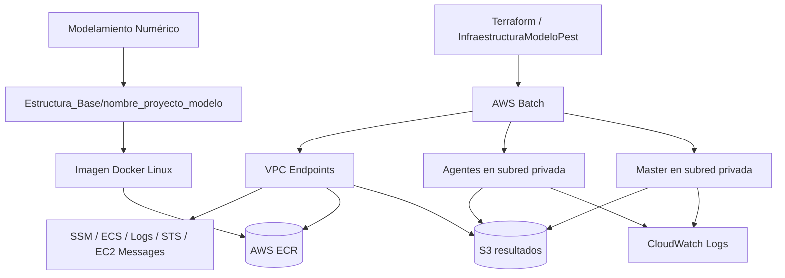

# PEST Calibración en AWS Batch

Repositorio para ejecutar calibraciones PEST de modelos hidrogeológicos en AWS usando contenedores Linux, AWS Batch, ECR, S3 y CloudWatch Logs. La arquitectura actual corre master y agentes en subredes privadas, sin IP pública, y se apoya en endpoints de VPC para acceder a los servicios de infraestructura necesarios.

## Índice

- [Descripción general](#descripción-general)
- [Arquitectura actual](#arquitectura-actual)
- [Estructura base del proyecto](#estructura-base-del-proyecto)
- [Requisitos](#requisitos)
- [Flujo de trabajo](#flujo-de-trabajo)
- [Variables e infraestructura](#variables-e-infraestructura)
- [Comandos de apoyo](#comandos-de-apoyo)
- [Puntos clave](#puntos-clave)

## Descripción general

PEST ajusta parámetros del modelo hasta que el comportamiento simulado se acerque a las observaciones. En esta implementación el proceso se ejecuta sobre AWS Batch y no sobre Fargate. El master y los agentes usan la misma imagen Docker y se despliegan en subredes privadas, con conectividad controlada por endpoints hacia los servicios que necesita la solución.

La secuencia general es:

1. Modelamiento Numérico entrega el modelo a ejecutar y el comando de inicio para master y agentes.
2. Soporte TI adapta el modelo para Linux, construye la imagen, publica en ECR y despliega la infraestructura.
3. Se levanta un master y un agente para la corrida inicial.
4. El auto-scaler monitorea la ejecución y ajusta la cantidad de agentes según la demanda del proceso PEST.
5. Al finalizar, se respaldan logs y resultados, y luego se elimina la infraestructura si corresponde.

## Arquitectura actual



### Componentes principales

- **AWS Batch**: orquesta el levantamiento de master y agentes como jobs en contenedores Linux.
- **Subredes privadas**: los jobs no exponen IP pública; la conectividad hacia AWS se resuelve con endpoints de VPC.
- **ECR**: almacena la imagen del modelo, que es la misma para master y agente.
- **S3**: recibe respaldos y resultados de ejecución.
- **CloudWatch Logs**: concentra los logs de master y agentes para monitoreo y diagnóstico.
- **SSM**: permite conexión y soporte operativo sobre el master cuando se necesita respaldo o revisión.

### Flujo de ejecución del modelo

El archivo `.pst` del modelo debe apuntar al script de inicio Linux correspondiente. En la base del proyecto se usan estos scripts:

- `ensibatch.sh`: ejecución normal del flujo del modelo.
- `ensibatch_timeout.sh`: envoltura con timeout, usada solo cuando se requiere límite máximo por corrida.

Si se activa el timeout, el `.pst` debe llamar explícitamente al script con `./` al inicio del nombre, porque Linux requiere la ruta relativa para ejecutar el archivo.

## Estructura base del proyecto

La carpeta que se debe copiar para crear un nuevo proyecto de calibración es:

`Estructura_Base/nombre_proyecto_modelo`

Su contenido está pensado como plantilla de arranque para un proyecto nuevo:

- `app/`: archivos base para que el modelo funcione en Linux y en la nube.
- `app/entrypoint_master.sh`: entrada del contenedor para master.
- `app/entrypoint_agent.sh`: entrada del contenedor para agentes.
- `app/entrypoint_autonomo.sh`: entrada para modo autónomo cuando aplica.
- `app/ensibatch.sh`: traducción Linux del `ensibatch.bat` entregado por el modelador.
- `app/ensibatch_timeout.sh`: versión con timeout cuando se necesita un máximo de ejecución por corrida.
- `app/modelo/`: carpeta donde se copia el modelo entregado por Modelamiento Numérico.
- `Dockerfile`: instrucciones para construir la imagen Linux.
- `requirements.txt`: dependencias Python del proyecto base.
- `InfraestructuraModeloPest/`: infraestructura y scripts de operación por proyecto y región.
- `InfraestructuraModeloPest/scripts/launch_master_agents.py`: crea master y agentes iniciales.
- `InfraestructuraModeloPest/scripts/stop_master_agents.py`: detiene master y/o agentes.
- `InfraestructuraModeloPest/scripts/auto_scaling_tasks.py`: monitorea la ejecución y ajusta agentes.
- `InfraestructuraModeloPest/scripts/backup_logs.py`: respalda logs de master y agentes.
- `AWS_Comandos/`: ejemplos de comandos para cada necesidad operativa.

### Consideración sobre nombres en Linux

Linux es case sensitive. Si el modelo original contiene nombres que cambian entre mayúsculas y minúsculas, se deben revisar los llamados en el `.pst`, los `.bat` convertidos a `.sh` y los archivos copiados a `app/modelo/`. En algunos casos conviene agregar alias o duplicados con el nombre exacto que espera PEST.

## Requisitos

### Software

| Herramienta | Versión mínima | Uso |
|-------------|----------------|-----|
| AWS CLI v2 | 2.x | Gestión de ECR, S3, Batch, ECS, SSM y Logs |
| Terraform | 1.0+ | Despliegue de infraestructura |
| Docker | 4.x | Construcción de la imagen del modelo |
| Python | 3.8+ | Scripts de apoyo y automatización |
| Session Manager Plugin | Latest | Conexión por SSM |

### Dependencias Python

La lista de dependencias se instala desde `requirements.txt`:

```bash
pip install -r requirements.txt
```

También puede usarse `uv` si se prefiere:

```bash
uv pip install -r requirements.txt
```

## Flujo de trabajo

### 1. Preparar un nuevo proyecto

Copiar la plantilla base:

```bash
cp -r Estructura_Base/nombre_proyecto_modelo <nuevo_proyecto>
```

Luego ajustar el contenido para el caso de uso concreto.

### 2. Recibir y adaptar el modelo

Modelamiento Numérico entrega:

- el modelo a ejecutar;
- el comando de inicio para master y agentes;
- los archivos `.pst`, `.tpl`, `.ins`, entradas MODFLOW y demás recursos del modelo.

Soporte TI realiza estas tareas:

1. Convierte el `.bat` a `.sh` para que el modelo corra en Linux.
2. Ajusta el archivo `.pst` para que llame al nuevo `.sh` usando `./` al inicio del nombre.
3. Copia el modelo a `Estructura_Base/nombre_proyecto_modelo/app/modelo/`.
4. Revisa nombres sensibles a mayúsculas y minúsculas.
5. Si se requiere un tope de tiempo, habilita `ensibatch_timeout.sh`.

### 3. Construir la imagen y publicarla

La imagen Docker que se genera es la misma para master y agente.

Pasos habituales:

1. Crear el repositorio en AWS ECR.
2. Construir la imagen con el `Dockerfile` de la plantilla.
3. Subir la imagen a ECR.
4. Crear el bucket S3 donde quedarán los resultados.

### 4. Configurar la infraestructura

Editar `variables.tf` con los valores del proyecto y la región. Los parámetros más importantes son:

- `s3_bucket_linux`: bucket creado para el proyecto.
- `ecr_image_linux`: ruta completa de la imagen publicada en ECR.
- `model_timeout`: se activa solo si se necesita un tiempo máximo por corrida.
- cualquier otra variable de red, región, nombres y recursos del despliegue.

Luego aplicar la infraestructura con Terraform:

```bash
terraform init
terraform plan
terraform apply
```

### 5. Levantar master y agente inicial

Ejecutar:

```bash
python Estructura_Base/nombre_proyecto_modelo/InfraestructuraModeloPest/scripts/launch_master_agents.py 1
```

Esto crea el master y un agente para la corrida inicial. Después hay que esperar a que ambos levanten, validar comunicación y confirmar que el modelo arranca correctamente.

### 6. Monitorear la calibración

Cuando el entorno ya está estable, ejecutar:

```bash
python Estructura_Base/nombre_proyecto_modelo/InfraestructuraModeloPest/scripts/auto_scaling_tasks.py
```

El script monitorea la necesidad de subir o bajar agentes según el comportamiento del proceso PEST.

### 7. Respaldar y detener

Para conectarse al master y realizar respaldos cuando sea solicitado o necesario, usar SSM.

Para detener la ejecución:

```bash
python Estructura_Base/nombre_proyecto_modelo/InfraestructuraModeloPest/scripts/stop_master_agents.py
```

Si solo se quiere detener los agentes y dejar el master activo, usar:

```bash
python Estructura_Base/nombre_proyecto_modelo/InfraestructuraModeloPest/scripts/stop_master_agents.py --agents
```

Luego respaldar logs:

```bash
python Estructura_Base/nombre_proyecto_modelo/InfraestructuraModeloPest/scripts/backup_logs.py
```

Este script respalda los logs de master y agentes.

### 8. Cerrar el proyecto

Cuando ya no se requiera la infraestructura:

```bash
terraform destroy
```

Finalmente, descargar los resultados a la carpeta compartida en Google Drive o al servidor indicado por el modelador.

## Variables e infraestructura

La infraestructura está pensada para operar con conectividad privada y sin IP pública. Por eso es importante revisar que existan los endpoints de VPC necesarios para los servicios utilizados por la solución, incluyendo al menos:

- S3
- ECR
- SSM
- ECS
- CloudWatch Logs
- STS
- EC2 Messages / SSMMessages

En `Estructura_Base/AWS_Comandos` hay ejemplos de comandos para cada necesidad operativa, por ejemplo:

- crear repositorios ECR;
- operar con Docker;
- conectar por SSM;
- preparar buckets S3;
- ejecutar acciones de infraestructura.

## Comandos de apoyo

### Crear ECR

```bash
aws ecr create-repository --repository-name <nombre-repo> --region <region>
```

### Construir la imagen

```bash
docker build -t <account-id>.dkr.ecr.<region>.amazonaws.com/<nombre-repo>:latest .
```

### Subir la imagen

```bash
aws ecr get-login-password --region <region> | docker login --username AWS --password-stdin <account-id>.dkr.ecr.<region>.amazonaws.com
docker push <account-id>.dkr.ecr.<region>.amazonaws.com/<nombre-repo>:latest
```

### Crear bucket S3

```bash
aws s3api create-bucket --bucket <bucket> --region <region> --create-bucket-configuration LocationConstraint=<region>
```

## Puntos clave

- El proyecto ya no usa Fargate; la documentación y la operación deben centrarse en AWS Batch.
- Master y agentes usan la misma imagen Docker.
- El modelo base para nuevos proyectos está en `Estructura_Base/nombre_proyecto_modelo`.
- `app/modelo/` recibe el modelo entregado por Modelamiento Numérico.
- `ensibatch.sh` es el flujo normal; `ensibatch_timeout.sh` se usa solo cuando se necesita límite de tiempo.
- Si el timeout se activa, debe quedar habilitado tanto en el `.pst` como en `main.tf`.
- `s3_bucket_linux` y `ecr_image_linux` son variables críticas para el despliegue.
- Linux distingue mayúsculas y minúsculas; revisar nombres y aliases antes de construir la imagen.
